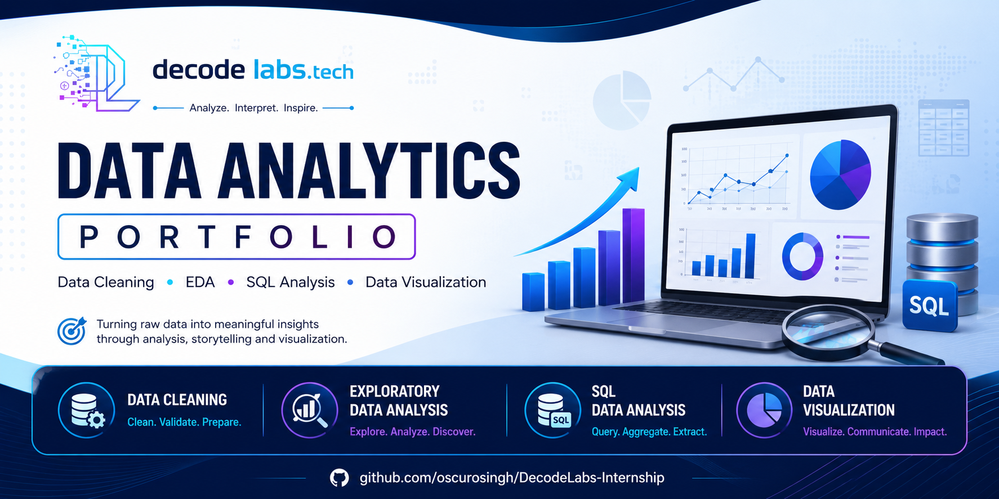
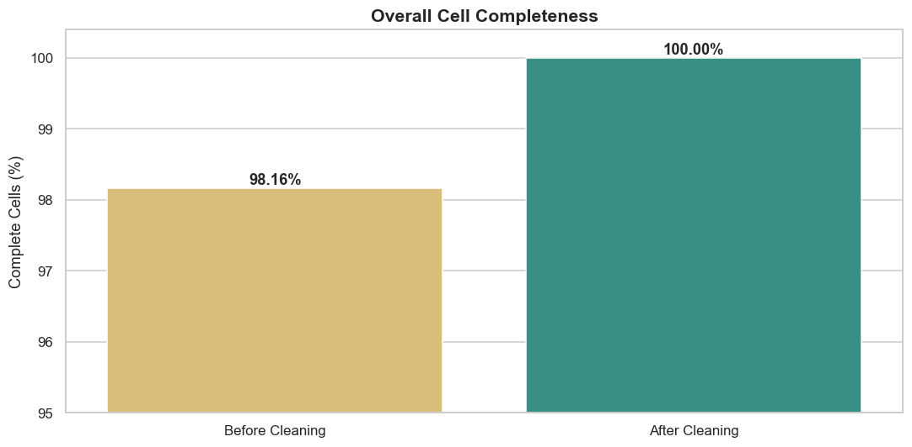
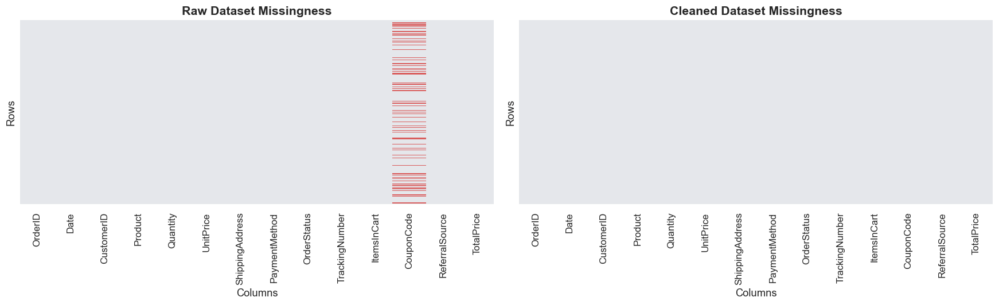
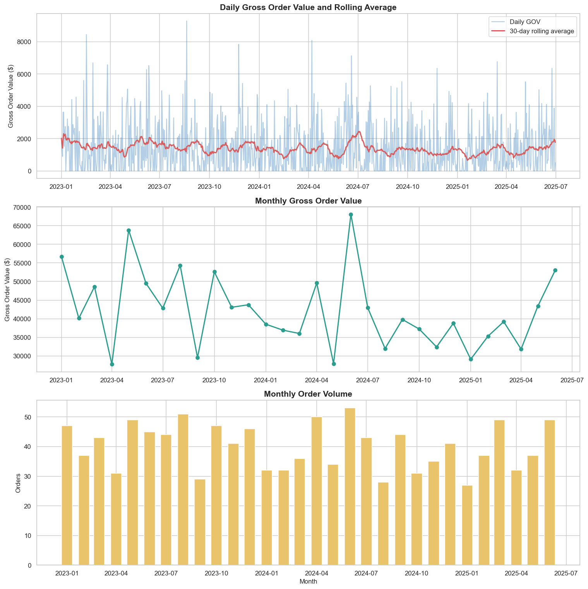
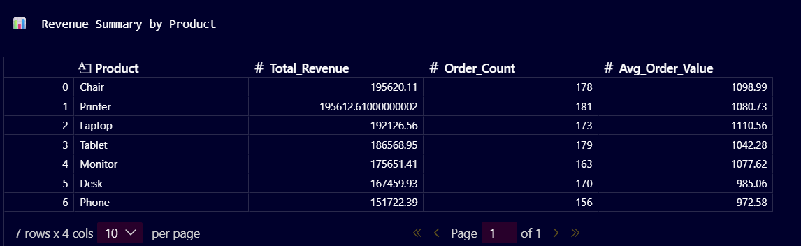
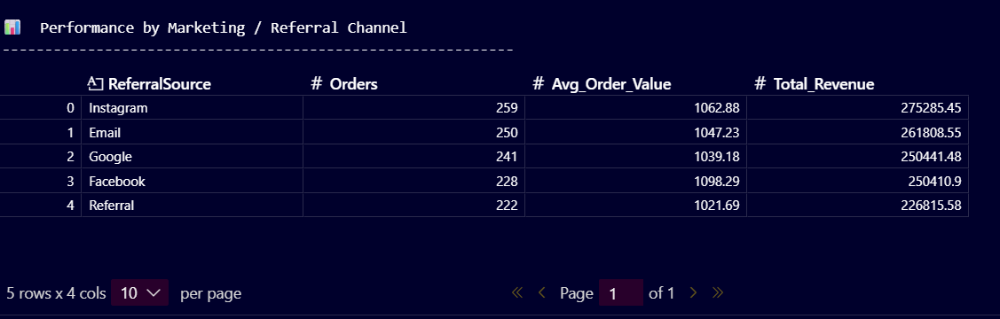
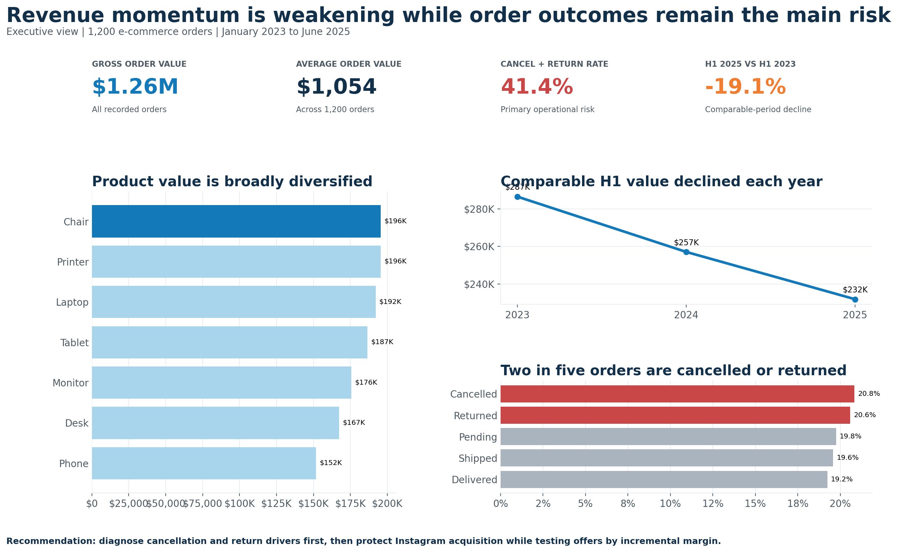

<p align="center">
  
</p>

<h1 align="center">DecodeLabs Internship – Data Analytics Portfolio</h1>

<p align="center">
  
  
  
  
</p>
<br>

## Overview

This repository contains all projects completed during the DecodeLabs Data Analytics Internship Program.

The internship focuses on developing practical data analytics skills through hands-on projects covering:

* Data Cleaning & Preparation
* Exploratory Data Analysis (EDA)
* SQL Data Analysis
* Data Visualization

Each project builds analytical skills progressively, moving from raw data preparation to business insight generation and visual communication.

**Repository:**  
https://github.com/oscurosingh/DecodeLabs-Internship
---
## Quick Navigation

- [Project 01 – Data Cleaning & Preparation](#project-01--data-cleaning--preparation)
- [Project 02 – Exploratory Data Analysis](#project-02--exploratory-data-analysis-eda)
- [Project 03 – SQL Data Analysis](#project-03--sql-data-analysis)
- [Project 04 – Data Visualization](#project-04--data-visualization)

---
## Project Statistics

| Metric | Value |
|----------|----------|
| Projects Completed | 4 |
| Dataset Records Analyzed | 1,200+ |
| Visualizations Created | 20+ |
| SQL Queries Executed | 30+ |
| Business Insights Generated | 50+ |
| Technologies Used | Python, SQL, Pandas, Matplotlib, Seaborn |

---
## Project Showcase

<table>
<tr>
<td width="50%">

### Project 01 – Data Cleaning



</td>

<td width="50%">

### Project 01 – Missing Value Resolution



</td>
</tr>

<tr>
<td width="50%">

### Project 02 – Revenue Trends



</td>

<td width="50%">

### Project 02 – Product Analysis


</td>
</tr>

<tr>
<td width="50%">

### Project 03 – Revenue Analysis



</td>

<td width="50%">

### Project 03 – Marketing Analysis



</td>
</tr>

<tr>
<td colspan="2">

### Project 04 – Executive Dashboard



</td>
</tr>
</table>

---
## Repository Structure

```text
DecodeLabs-Internship
│
├── Assets
│   ├── repository_banner.png
│   ├── project01_*.png
│   ├── project02_*.png
│   ├── project03_*.png
│   └── project04_*.png
│
├── Project_01
│   ├── Project1_Data_Cleaning.ipynb
│   ├── Dataset_for_Data_Analytics.xlsx
│   ├── requirements.txt
│   └── README.md
│
├── Project_02
│   ├── EDA_Project.ipynb
│   ├── Dataset for Data Analytics.xlsx
│   ├── requirements.txt
│   └── README.md
│
├── Project_03
│   ├── Data Analytics Project 3.ipynb
│   ├── Dataset_for_Data_Analytics.xlsx
│   ├── requirements.txt
│   └── README.md
│
└── Project_04
    ├── Project4_Data_Visualization.ipynb
    ├── data_visualization.py
    ├── outputs/
    ├── requirements.txt
    └── README.md
```

---

# Project 01 – Data Cleaning & Preparation

### Goal

Clean a raw dataset by handling missing values, duplicates, and incorrect data.

### Key Tasks

* Identify missing or null values
* Remove duplicate records
* Correct data formats
* Validate dataset consistency
* Prepare data for further analysis

### Skills Used

* Python
* Pandas
* Data Cleaning
* Data Preparation
* Data Quality Assessment

### Deliverables

* Data Cleaning Notebook
* Cleaned Dataset
* Project Documentation

---

# Project 02 – Exploratory Data Analysis (EDA)

### Goal

Analyze a dataset to understand patterns, trends, and distributions.

### Key Tasks

* Calculate descriptive statistics
* Analyze distributions
* Identify trends
* Detect outliers
* Summarize key observations

### Skills Used

* Exploratory Data Analysis
* Descriptive Statistics
* Data Visualization
* Analytical Thinking

### Deliverables

* EDA Notebook
* Statistical Analysis
* Business Insights Summary

---

# Project 03 – SQL Data Analysis

### Goal

Use SQL queries to extract insights from a dataset.

### Key Tasks

* Write SELECT queries
* Filter data using WHERE
* Sort data using ORDER BY
* Group records using GROUP BY
* Perform aggregations using:

  * COUNT()
  * SUM()
  * AVG()

### Skills Used

* SQL Fundamentals
* Data Querying
* Data Aggregation
* Business Analysis

### Deliverables

* SQL Analysis Notebook
* Query Solutions
* Insight Summary

---

# Project 04 – Data Visualization

### Goal

Create visual representations of data to communicate insights clearly.

### Key Tasks

* Create bar charts
* Create line charts
* Create pie charts
* Select appropriate visualizations
* Highlight important insights

### Skills Used

* Data Visualization
* Matplotlib
* Seaborn
* Plotly
* Data Storytelling

### Deliverables

* Visualization Notebook
* Dashboard Outputs
* Executive Visual Reports

---

## Technologies Used

### Programming

* Python

### Data Analysis

* Pandas
* NumPy

### Visualization

* Matplotlib
* Seaborn
* Plotly

### Development Environment

* Jupyter Notebook
* VS Code

### Data Formats

* Excel
* CSV

---
## Skills Matrix

| Project | Core Skills |
|----------|----------|
| Project 01 | Data Cleaning, Validation, Preparation |
| Project 02 | EDA, Statistics, Trend Analysis |
| Project 03 | SQL, Aggregations, Business Queries |
| Project 04 | Visualization, Dashboards, Storytelling |

---
## Learning Outcomes

Through these projects, I gained hands-on experience in:

* Cleaning and preparing raw datasets
* Performing exploratory data analysis
* Extracting insights using SQL
* Creating effective visualizations
* Communicating findings through data storytelling
* Applying analytical thinking to business datasets

---
## Key Results

- Cleaned and validated 1,200+ transaction records.
- Improved dataset completeness to 100%.
- Performed comprehensive exploratory data analysis and trend identification.
- Developed SQL queries for revenue, customer, and marketing analysis.
- Built executive dashboards and business-focused visual reports.
- Generated actionable insights through data storytelling.

---
## Author

**Shubham Kumar Singh**

B.Sc. (Hons.) Physics – University of Delhi

Aspiring Data Analyst | Data Science & Machine Learning Enthusiast

- GitHub: https://github.com/oscurosingh
- Repository: https://github.com/oscurosingh/DecodeLabs-Internship
- LinkedIn: <https://www.linkedin.com/in/shubham-kumar-singh-oscuro/>

---

## License

This project is licensed under the MIT License. See the LICENSE file for details.
